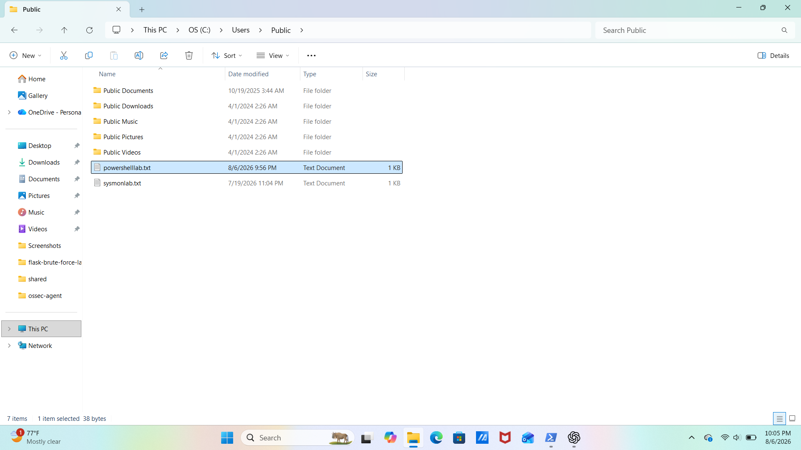
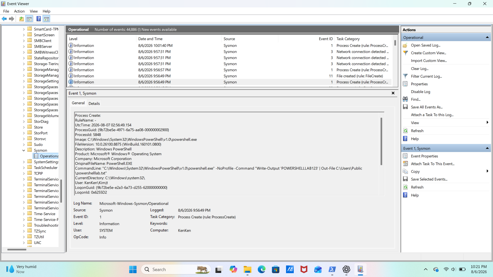

# PowerShell Wazuh Detection Lab

## Overview

This lab demonstrates how PowerShell activity can be generated, captured by Sysmon, and investigated in Wazuh SIEM.

## Tools Used

- PowerShell
- Sysmon
- Windows Event Viewer
- Wazuh SIEM

## Lab Objective

The objective was to generate controlled PowerShell activity, verify that Sysmon captured the process creation event, and locate the same activity in Wazuh for investigation.

## Activity Generated

The following PowerShell command was executed:

```powershell
powershell.exe -NoProfile -Command "Write-Output 'POWERSHELLLAB123' | Out-File C:\Users\Public\powershelllab.txt"

## File Creation

The command successfully created:

`C:\Users\Public\powershelllab.txt`



## Sysmon Detection

Sysmon recorded the PowerShell activity as a Process Create event.

- Event ID: 1
- Process: `powershell.exe`
- Command line contained: `POWERSHELLLAB123`



## Wazuh Detection

A field-specific Lucene query was used to locate the activity:

```text
data.win.eventdata.commandLine:*POWERSHELLLAB123*
